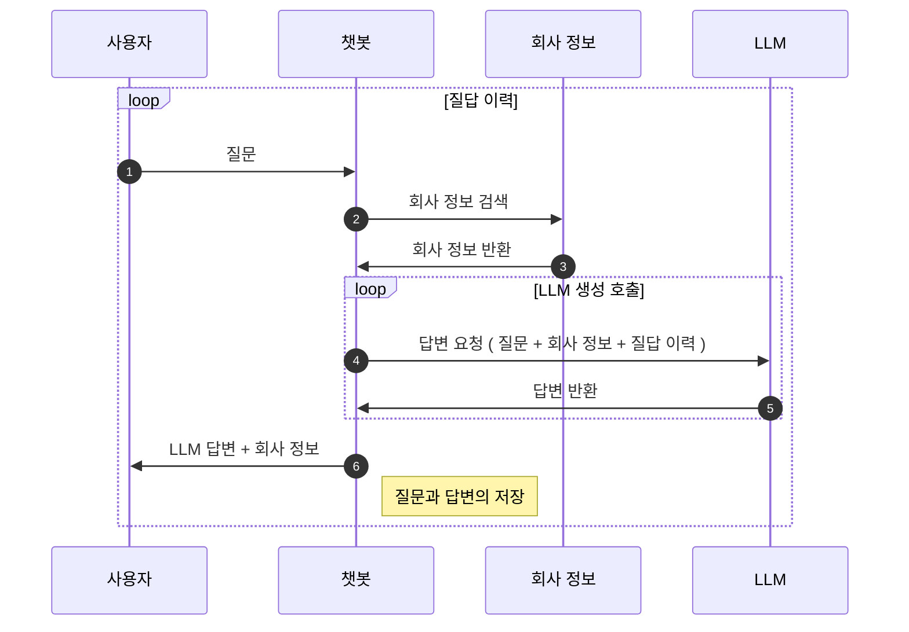

아래 사용자의 질문에 대하여 회사 정보와 LLM 답변이 이루어 지는 기본 흐름 정보입니다.

```mermaid
sequenceDiagram
    autonumber
    loop 질답 이력
    사용자->>챗봇: 질문
    챗봇->>회사 정보: 회사 정보 검색
    회사 정보->>챗봇: 회사 정보 반환
    loop LLM 생성 호출
    챗봇->>LLM: 답변 요청 ( 질문 + 회사 정보 + 질답 이력 )
    LLM->>챗봇: 답변 반환
    end
    챗봇->>사용자: LLM 답변 + 회사 정보
    Note right of 챗봇: 질문과 답변의 저장
    end

```

> 옵션에 따라 세부적인 분기는 달라질 수 있습니다.
> 상담사 연결 및 회사 정보의 관리 흐름도 작성 예정
>
