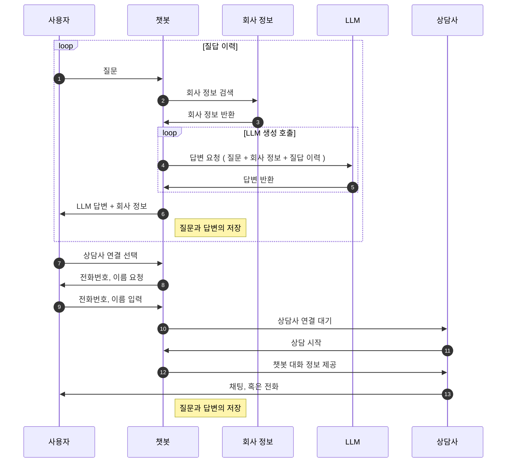

{}
고객이 상담사 연결을 선택하면 상담사는 자동/수동으로 응대합니다.
{}

1. 챗봇과 대화하던 고객이 '상담사와 연결'을 선택합니다.
2. 상담사는 좌측 상담 대기 리스트에서 상담 시작을 선택합니다.
3. 가운데 상담 화면에 고객과 챗봇간의 대화 내용이 표시됩니다.
4. 고객 창에 '상담사가 연결되었습니다' 는 메시지가 표시됩니다.
5. 고객과 상담사 간의 채팅이 진행됩니다.

--------------------------

